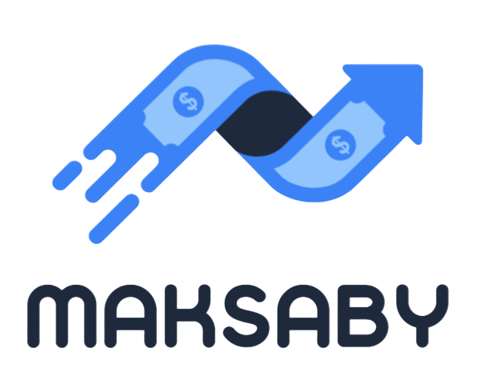

# Maksaby - Inventory & Order Management System

<div align="center">
  
  <p><strong>A comprehensive inventory and order management system for retail stores</strong></p>
  <p>Built with Next.js 15 with full Arabic language and RTL support</p>
</div>

## 🌟 Features

### 📊 Comprehensive Dashboard
- Real-time sales and profit metrics
- Product statistics and inventory status
- Customer engagement overview
- Low stock alerts

### 📦 Inventory Management
- Add, edit, and delete products with image upload
- Track stock levels in real-time
- Stock movement tracking (IN/OUT)
- Low stock notifications
- Product categorization

### 🛒 Order Management
- Create POS orders with automatic profit calculation
- Order status tracking (Completed, Pending, Cancelled)
- Customer order history
- Detailed order breakdown with costs and profits

### 👥 Customer Management
- Comprehensive customer directory
- Contact information management
- Purchase history tracking
- Customer-specific notes

### 💰 Expense Tracking
- Record expenses by different categories
- Track business costs for accurate profit calculation
- Expense history and reports

### 📝 Notes Management
- Create and manage notes for customers and orders
- Keep important business information organized
- Toggle visibility and priority

### 🔐 Authentication & Security
- JWT-based secure authentication
- Multi-tenant support
- Protected routes and API calls
- User profile management

### 🌐 Arabic-First Design
- Full RTL (Right-to-Left) support
- Arabic UI throughout the application
- Cairo font for beautiful Arabic typography
- Localized error messages and notifications

## 🛠️ Tech Stack

### Frontend
- **Next.js 15** - React framework with App Router and TypeScript
- **Tailwind CSS** - Utility-first CSS with RTL plugin
- **shadcn/ui** - Beautiful, accessible component library
- **TanStack Query** - Server state management
- **React Hook Form** - Form handling and validation
- **Zod** - Schema validation
- **Axios** - HTTP client
- **Lucide React** - Icon library
- **Cairo Font** - Arabic typography

### Analytics & Monitoring
- **Vercel Analytics** - Performance monitoring
- **Vercel Speed Insights** - Core Web Vitals tracking

## 📋 Prerequisites

- Node.js 18+ 
- npm, yarn, or pnpm
- Backend API (see Backend Requirements section)

## 🚀 Getting Started

### 1. Install Dependencies

```bash
npm install
# or
yarn install
# or
pnpm install
```

### 2. Environment Setup

Create a `.env.local` file in the root directory:

```env
NEXT_PUBLIC_API_URL=http://localhost:5000/api
NEXT_PUBLIC_APP_NAME=مكسبي
NEXT_PUBLIC_CURRENCY=EGP
```

### 3. Run Development Server

```bash
npm run dev
# or
yarn dev
# or
pnpm dev
```

Open [http://localhost:3000](http://localhost:3000) in your browser.

### 4. Build for Production

```bash
npm run build
npm start
```

## 📁 Project Structure

```
maksaby-frontend/
├── app/
│   ├── page.tsx              # Landing page with features showcase
│   ├── auth/
│   │   ├── login/            # Login page
│   │   ├── register/         # Registration page
│   │   ├── forgot-password/  # Password recovery
│   │   ├── reset-password/   # Password reset
│   │   └── welcome/          # Welcome page after registration
│   ├── dashboard/
│   │   ├── page.tsx          # Main dashboard
│   │   ├── products/         # Products management
│   │   ├── orders/           # Orders management
│   │   ├── customers/        # Customers management
│   │   ├── expenses/         # Expenses tracking
│   │   ├── stock/            # Stock movements
│   │   ├── notes/            # Notes management
│   │   └── settings/         # User settings
│   ├── api/                  # API route handlers
│   ├── layout.tsx            # Root layout
│   └── globals.css           # Global styles
├── components/
│   ├── ui/                   # shadcn/ui components
│   ├── dashboard-sidebar.tsx # Sidebar navigation
│   ├── *-form-dialog.tsx     # Form dialogs for entities
│   ├── confirm-dialog.tsx    # Confirmation dialog
│   └── providers.tsx         # App providers
├── lib/
│   ├── api-client.ts         # Axios configuration
│   ├── utils.ts              # Utility functions
│   └── translations.ts       # Arabic translations
├── hooks/
│   └── use-auth.ts           # Authentication hook
├── types/
│   └── index.ts              # TypeScript type definitions
└── public/
    └── logo.png              # App logo
```

## 🔌 Backend API Requirements

This frontend requires a .NET 8 backend API with the following endpoints:

### Authentication
- `POST /api/Auth/login` - User login
- `POST /api/Auth/register` - User registration
- `POST /api/Auth/forgot-password` - Request password reset
- `POST /api/Auth/reset-password` - Reset password with OTP

### Products
- `GET /api/Products` - Get all products (with pagination)
- `GET /api/Products/{id}` - Get product by ID
- `POST /api/Products` - Create new product
- `PUT /api/Products/{id}` - Update product
- `DELETE /api/Products/{id}` - Delete product

### Orders
- `GET /api/Orders` - Get all orders
- `GET /api/Orders/{id}` - Get order details
- `POST /api/Orders` - Create new order
- `PUT /api/Orders/{id}` - Update order
- `GET /api/Orders/customer/{customerId}` - Get customer orders

### Customers
- `GET /api/Customers` - Get all customers
- `GET /api/Customers/{id}` - Get customer by ID
- `POST /api/Customers` - Create new customer
- `PUT /api/Customers/{id}` - Update customer
- `DELETE /api/Customers/{id}` - Delete customer

### Expenses
- `GET /api/Expenses` - Get all expenses
- `GET /api/Expenses/{id}` - Get expense by ID
- `POST /api/Expenses` - Create new expense
- `PUT /api/Expenses/{id}` - Update expense
- `DELETE /api/Expenses/{id}` - Delete expense

### Stock Movements
- `GET /api/StockMovements` - Get stock movement history
- `POST /api/StockMovements` - Record stock movement

### Notes
- `GET /api/Notes` - Get all notes
- `GET /api/Notes/customer/{customerId}` - Get customer notes
- `POST /api/Notes` - Create new note
- `PUT /api/Notes/{id}` - Update note
- `DELETE /api/Notes/{id}` - Delete note
- `PUT /api/Notes/{id}/toggle` - Toggle note visibility

### Dashboard
- `GET /api/Dashboard/metrics` - Get dashboard metrics and statistics

### User Profile
- `GET /api/User/profile` - Get user profile
- `PUT /api/User/profile` - Update user profile

## 📧 Contact

For support or inquiries: maksaby.business@gmail.com

## 📄 License

MIT License

## 🙏 Acknowledgments

Built with modern web technologies and best practices for performance and user experience.
